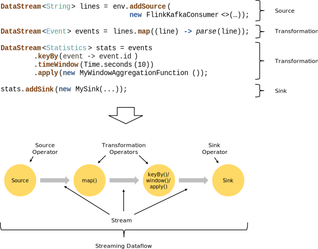

 # AvroSqlApplicationMode

This repository contains a templated flink job. Processing is handled by Apache Flink which is a stateful scalable stream processing framework. You can find more information about Apache Flink [here](https://flink.apache.org/).

The flink job consumes messages from a kafka topic with simple avro messages, apply a sql query on these message and push out to a sink the filtered messages in selectable format. The message in input should be `avro` or `avroConfluent` 
and the output is selectable in `avro`, `avroConfluent` or `json`.
The job also infer the metadata of the input kafka message from the schema registry from the last created message subject, take the last valid registry and apply the same schema to the sink result messages.

## Project structure

The following list explains some of the major components of the project, in order to familiarize newcomers with the structure:

- `/src` - Java source code containing the Flink job
  - `main` - Source code for the job itself
  - `test` - Unit tests for the job
- `/ComponentTest` - .NET test project, which is used for component testing the Flink job, it sends three messages and in turn the schema registry in the 
  - `Dockerfile` - to allow testing within Docker
- `Dockerfile` - for building the Flink job.
- `docker-compose.yaml` - allows running the Flink job and component test within Docker, with necessary environment values, port bindings, etc. for local development.
- `pom.xml` - Project Object Model, which defines how to build the Flink job, which dependencies it requires and necessary plugins for building and testing.
- `README.md` - This file
- `settings.xml` - Settings file used to configure access to the Maven Package Repository.

## Prerequisites

This project depends on maven packages that are located on the
Cheetah Maven Repository on github,
and thus requires access to the Cheetah Maven Repository on Github.
To enable access you need to get create a personal token by going to
[https://github.com/settings/tokens/new](https://github.com/settings/tokens/new)
and creating a token with the `read:packages` scope.

To run the docker containers you need to set the following environment variables:

```bash
export GITHUB_ACTOR=your-github-username # replace with your github username
export GITHUB_TOKEN=your-github-token # replace with the token you generated in the previous paragraph
```

Then verify that you're able to build docker images by running:

```bash
docker compose build
```

## Local development

For local development, you will need to clone the [cheetah-development-infrastructure](https://github.com/trifork/cheetah-development-infrastructure) repository. 

You'll then be able to run necessary infrastructure with the following command from within that repository:

```bash
docker compose --profile=kafka up -d
```

This will start `kafka`, `schema-registry`, `keycloak` and `redpanda`, which can be used to inspect what topics and messages exist in `kafka`. 

Redpanda can be accessed on [http://localhost:9898](http://localhost:9898).

You need to create the source topics which the flink job reads from. This is done by setting the `INITIAL_KAFKA_TOPICS` to `AvroSqlApplicationModeInputTopic AvroSqlApplicationModeOutputTopic` before running the `kafka-setup` container in `cheetah-development-infrastructure`:
```powershell
$env:INITIAL_KAFKA_TOPICS="AvroSqlApplicationModeInputTopic AvroSqlApplicationModeOutputTopic"; docker compose up kafka-setup -d
```
The `kafka-setup` service is also run when starting kafka using the above command, but running it seperately enables you to create the topics with an already running Kafka.
Alternatively you can create the topics manually in Redpanda.

`cheetah-development-infrastructure` contains more than just the services that the above command starts, but running the entire infrastructure setup takes up a fair amount of resources on your local system. 

If you need to run other services like OpenSearch, please see the documentation in the `development-infrastructure` repository.

## Inspect and modify using Intellij

When developing your job you can run/debug it like any other Java application by running the `main` method in AvroSqlApplicationModeJob.

1. Configure the project to use JDK 11: File > Project Structure: Project > Project SDK: 11

1. Verify that the project builds by pressing `Ctrl + F9`
    > [!WARNING]
    > If either the project does not build or your Intellij is showing errors in the file, try syncing your maven projects by unfolding the Maven window (by default the top tab in the small vertical bar on the right of the IDE) and pressing the "Reload All Maven Projects"-button in the top-left of that window, then, restart Intellij.
    > The very first build can take a while, as maven builds up its cache.

1. Navigate to the file `AvroSqlApplicationModeJob.java`, under the `src/main/java/cheetah/example/avrosqlapplicationmode/job/` folder.

1. This file contains a job that performs a mapping on all incoming `InputEvents`. It consists of the following pieces:
    <details>
    <!-- Have an empty line after the <details> tag or markdown blocks will not render. -->

    - A static main method, which is used to start the job itself.
    - 2 methods for create an source table, it is important that these parameters reflect the messages type that comes from the kafka stream:
        - One create a table in case of avro source`--input-type = "avro"`
        - One create a table in case of avro-confluent source`--input-type = "avroConfluent"`
    - 3 methods for create an sink table:
        - One create a avro sink in case of `--output-type = "avro"`
        - One create a avro-confluent sink in case of `--output-type = "avroConfluent"`
        - One create a json sink in case of `--output-type = "json"`
    - A method for make a REST GET request to the APICURIO schema registry API to get the schema registry of the last message
    - A method for JSONfy the schema registry
    - A method for transform the schema registry and format and clean the information to a valid SQL metadata for build the source and sink data tables
    </details>

1. After selected the type of the input depending strictly on the type `--input-type` in the source kafka topic and preferred output type of messages `--output-type`, modify the `--sql` 
parameters regarding the `--source`, `--sink` kafka topic inserted. Important is, that the input topic `--source` contains messages only of one `--input-type` (`"avro"` or `"avroConfluent"`), otherwise the deserialization fail. An example setting is provided below.

1. Create Intellij run profile for AvroSqlApplicationModeJob.java with parameters, by right-clicking the file `AvroSqlApplicationModeJob` and select `Modify Run Configuration...`.

1. Enter the following program arguments formatted as in this example below to model the job properly:
  ```
  --sql "INSERT INTO sqlSinkTopic SELECT avroInputTopic.deviceId, avroInputTopic.`value`, avroInputTopic.`timestamp`, avroInputTopic.extraField FROM avroInputTopic WHERE avroInputTopic.deviceId LIKE 'deviceId-2'"
  --source avroInputTopic
  --sink sqlSinkTopic
  --input-type avroConfluent
  --output-type avroConfluent
  ```

1. Enter the following program arguments:
  ```  
  --kafka-bootstrap-servers localhost:9092
  --group-id avroSql-group-id
  --sr-url http://schema-registry:8080/apis/ccompat/v7
  --token-url http://keycloak:1852/realms/local-development/protocol/openid-connect/token
  --apicurio-client-id default-access
  --client-secret default-access-secret
  --scope schema-registry
  ```

  And add the following Environment variables:
  ```
  - SCHEMA_REGISTRY_CLIENT_ID: default-access
  - SCHEMA_REGISTRY_CLIENT_SECRET: default-access-secret
  - SCHEMA_REGISTRY_SCOPE: schema-registry
  - SCHEMA_REGISTRY_TOKEN_URL: http://keycloak:1852/realms/local-development/protocol/openid-connect/token
  - SECURITY_PROTOCOL=SASL_PLAINTEXT
  - TOKEN_URL=http://keycloak:1852/realms/local-development/protocol/openid-connect/token
  - KAFKA_CLIENT_ID=default-access
  - KAFKA_CLIENT_SECRET=default-access-secret
  - KAFKA_SCOPE=kafka
  ```
  You can insert the following string in the `Environment variables` field:

  ```text
  SECURITY_PROTOCOL=SASL_PLAINTEXT;TOKEN_URL=http://localhost:1852/realms/local-development/protocol/openid-connect/token;KAFKA_CLIENT_ID=default-access;KAFKA_CLIENT_SECRET=default-access-secret;KAFKA_SCOPE=kafka
  ```
1. Notice how the job is configured to consume events from topic `avroInputTopic` and output to `sqlSinkTopic`
1. Save configuration by clicking OK
  > [!IMPORTANT]
  > When running the job you might see a warning in the console informing that *An illegal reflective access operation has occurred*, which can be ignored.
  
  > [!IMPORTANT]
  > Check that the container `avrosqlapplicationmode-test` has finished before the `avrosqlapplicationmode-jobmanager` because it warm-up the system sending three messages to the source topic and so create the schema registry. In case of failure of the job by not finding the schema registry, retry the container `avrosqlapplicationmode-jobmanager` that will find the schema registry freshly created

## Tests
### Unit tests

This project contains a sample Unit test in `src/test/java/cheetah/example/avrosqlapplicationmode/job/AvroSqlApplicationModeMapperTest.java` and
`src/test/java/cheetah/example/avrosqlapplicationmode/job/AvroSqlApplicationModeJobTest.java` , which utilizes JUnit5.

Unit tests are automatically run as part of the build processing when building the Flink job through either `mvn`, Intellij or Docker.

```sh
docker compose up avrosqlapplicationmode-jobmanager avrosqlapplicationmode-taskmanager --build
```

Similarly, you can run just the component test through docker compose using:
```sh
docker compose up avrosqlapplicationmode-test --build
```

If doing so, make sure to run your job locally from Intellij before starting the component test.

The component test is producing a tree messages with different `deviceId` for the last two to `avroInputTopic`, and listening for any messages published to `sqlSinkTopic`. It expects the flink job to publish at least one message in the sink.
You can observe the topics and produced messages at [http://localhost:9898](http://localhost:9898).

#### Persisted data during development

You might encounter failing component tests due to your job receiving more messages than expected. This occurs if you've previously run the job and component tests and data is still present in Kafka. The component test will then, in some cases, re-read the output of previous runs.

To fix this, you'll need to delete the data in Kafka by running: `docker compose down` in the `cheetah-development-infrastructure` repository and then starting it again using the command in [Local development with docker-compose](#local-development-with-docker-compose). This deletes the volume containing Kafka's data and starts everything up again.

#### Concurrent tests

While .NET allows running multiple tests in parallel, it is generally a difficult task to ensure that a Flink job correctly handles receiving data intended for testing multiple different "scenarios" at once.

This is a fairly complicated topic to explain accurately, which involves both the way Flink handles incoming messages and how time progresses from the perspective of a Flink Job. The Flink documentation is generally good at explaining many of these nuances - A solid place to start would be: [Timely Stream Processing | Apache Flink](https://nightlies.apache.org/flink/flink-docs-release-1.16/docs/concepts/time/).

The general recommendation is to avoid running multiple component tests at the same time. You _may_ be able to run multiple tests in succession, but, depending on the implementation and requirements of both the job and the test, your mileage may wary.

Because of this component testing should, in most scenarios, be kept to testing the job generally (primary functionality, correct input/output models, etc.) while ensuring the finer details of the implementation with unit tests.

# Implementing a new Flink job

## What is a job?

A job in Flink consists of a number of sources, a number of sinks, and a number of transformation steps.

From each source you will get a stream. This stream can be transformed, split, or combined with other streams. Each transformation will take a stream as input and return a stream that can be used as an input for another transformation or sent to a sink.

Some process functions (transformation) can combine two sources. By specifying a common property in `keyBy` it is ensured that related events from the two sources will run in the same thread and have access to the same state. An example could be data enrichment where a main stream is combined with a secondary stream, returning a new stream enriched by data from the secondary stream.

Besides the main stream returned from a process function, some type of functions can generate side outputs which will generate secondary streams that can be consumed by other transformations or sinks. This allows for functions to generate multiple events from a single event.



## KISS

The job should have minimum responsibility and business logic. Better to have multiple, simple jobs with a small amount of responsibility, than a single, complex job.

In most scenarios, output data should be stored in a Kafka topic. This makes it possible for others to consume the data your job outputs. 

If data needs to be persisted in a database for direct query by some other service, this should be done by the standard storage job.

## TDD

An approach proven to be good, is to start by writing a unit test for the processing job under development.
Then proceed in micro iterations, carefully assert expected output and behavior.
The project includes several examples for JUnit tests.

It is not recommended to use Mockto, since Flink is not happy about it and will produce unstable results.